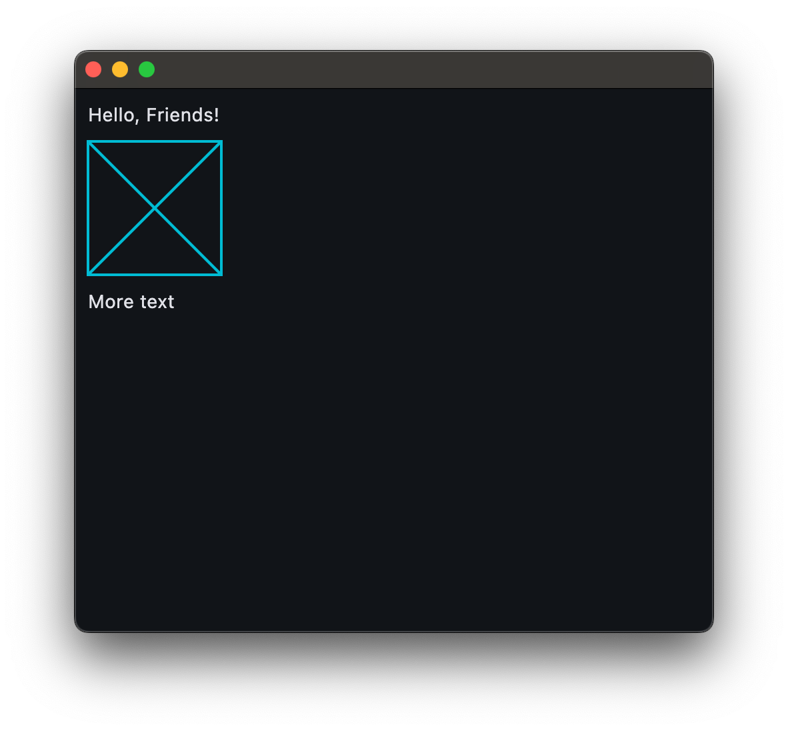

# Flet

Henri,

The attempt was to create a Placeholder control just for practice.  The code for the client side is in the usual place under packages packages/flet_placeholder.

Likewise, you'll find sdk/python/packages/src/flet_core/placeholder.py

There's a playground in the repository with main_test_placeholder.py in it.

Once all is in place it should look like:

As usual, you can find me on Discord or

* [Email](mailto:jim@lgx.com)

# flet-trial
